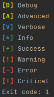
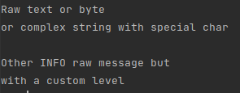

# R2Log - Ready To Log
Custom overload of the python logger to integrate additional levels (verbose, advanced, success) by integrating Rich for advanced rendering (color, emoji, etc.).

Easy to deploy in a project and to use, ready to go.

## Installation

Add `R2Log` to your requirements.txt file and `pip3 install R2Log` on your dev env.

# How to use

## Initialization

```python
from R2Log import logger

logger.setVerbosity(0)  # Default INFO level 
logger.setVerbosity(1)  # Set VERBOSE level 
logger.setVerbosity(2)  # Set ADVANCED level 
logger.setVerbosity(3)  # Set DEBUG level 

logger.setVerbosity(quiet=True)  # Set CRITICAL level 
```

## Log messages by level

```python
from R2Log import logger

logger.setVerbosity(3)

logger.debug("Debug")
logger.advanced("Advanced")
logger.verbose("Verbose")
logger.info("Info")
logger.success("Success")
logger.warning("Warning")
logger.error("Error")
logger.critical("Critical")
```



## Nice to have

```python
from R2Log import logger, ExeLog

logger.setVerbosity(1)
logger.raw("""Raw text or byte 
or complex string with special char""")
logger.empty_line()
logger.empty_line()
logger.raw(level=ExeLog.DEBUG, msg="""Debug but 
with a custom level""")
logger.raw(level=ExeLog.INFO, msg="""Other INFO raw message but 
with a custom level""")
```



## Argparse argument and level init

```python
import argparse, sys
from R2Log import logger

parser = argparse.ArgumentParser()
parser.add_argument("-v", "--verbose",
                    action="count",
                    default=0,
                    help="Verbosity level (-v for verbose, -vv for advanced, -vvv for debug)")
if len(sys.argv) == 1:
    parser.print_help()
    sys.exit(1)

args = parser.parse_args()
logger.setVerbosity(args.verbose)
```
